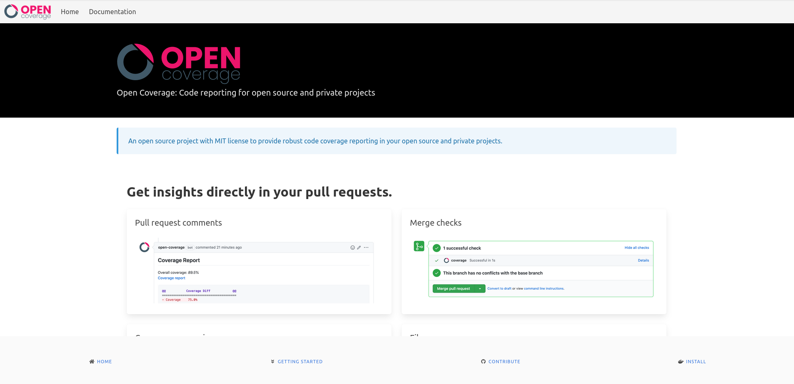

# Open Coverage

[](https://open-coverage.org/vangheem/repos/opencoverage)
[](https://github.com/vangheem/opencoverage/actions)
[](https://github.com/vangheem/opencoverage/blob/master/LICENSE)
[](https://hub.docker.com/r/opencoverage/api)
[](https://hub.docker.com/r/opencoverage/frontend)

Free and open source alternative providing coverage reporting and diff coverage reporting.

The project can be simple replacement for [Codecov](https://about.codecov.io/) or [Coveralls](https://coveralls.io/) for teams working on private repositories.

(some of the enterprise option pricing seemed a little unreasonable)

Features:

- Coverage reporting
- Diff coverage reporting
- GitHub integration: PRs, comments
- Codecov CLI compatible

Requirements:

- [SQLAlchemy](https://www.sqlalchemy.org/ "Link to SQLAlchemy site") compatible backend(PostgreSQL, SQLite, MySQL, etc)
- Open Coverage backend
- Open Coverage frontend

SCM integrations:

- [x] GitHub
- [ ] Bitbucket
- [ ] GitLab

## Prerequisites

Please make sure that you have the following dependencies installed

- [Docker](https://www.docker.com/)
- [Docker Compose](https://docs.docker.com/compose/)

### Development

- [Poetry](https://python-poetry.org/)

## Getting started

You can use `docker-compose` to start Open Coverage.

```sh
docker-compose up
```

This will start the backend, frontend, PostgreSQL and NGINX.
If you want to change to another supported database you have to adjust the *docker-compose.yaml* file.

Depending on your machine and internet connection is can take a moment till everything is running.
Once `docker-compose` is ready you can browse to http://localhost:3000/ to checkout the frontend and documentation.



## Configuration

To run the server yourself, you need to create a GitHub application and install
it for your organization.

All configuration is done with env variables.

- host
- port
- public_url
- root_path: root path api is served from
- dsn: connection string for backend database
- cors: hosts frontend runs on
- scm: enum(`github`)
- github_app_id: ID of app
- github_app_pem_file: pem file for application you created
- github_default_installation_id: ID of org this app is installed on

## Backend development

Develop:

```sh
make install-dev
```

Tests:

Run docker compose first:

```sh
docker-compose up postgres
```

```sh
make test
```

Run:

```sh
make run
```

## Frontend development

This project uses [Next.js](https://nextjs.org/ "Link to Next.js site").
See the `app` directory for details.

## Send report from CI

The backend is compatible with the Codecov CLI.

You need to provide the installation id of your org as the `--token` value
or `dummy` if you are using the `github_default_installation_id` setting
and only using the server for a single org.

```sh
codecov --url="http://<installed-host>:8000" --token=<github installation id> --slug=vangheem/opencoverage
```
